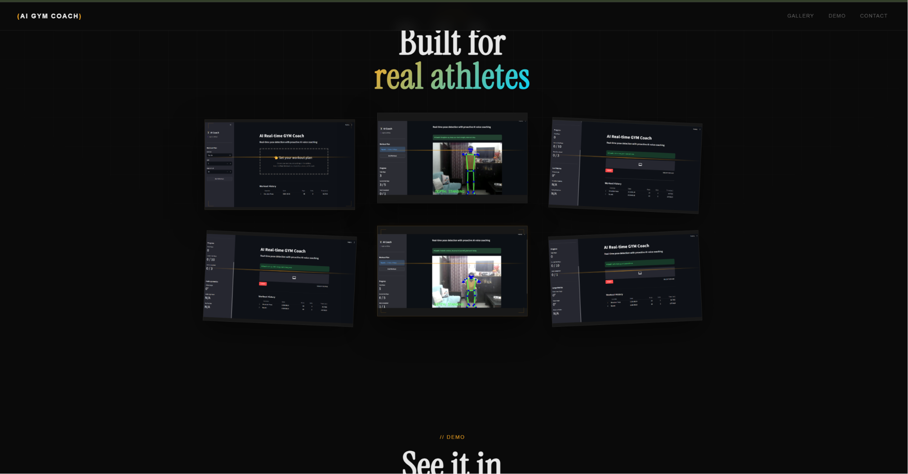
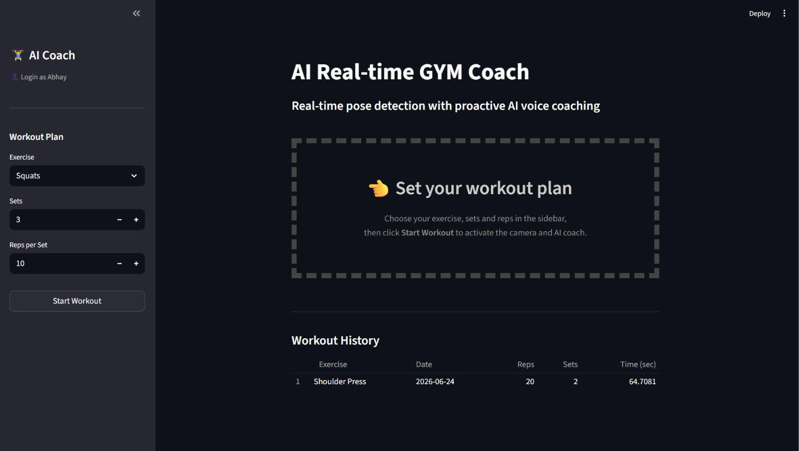
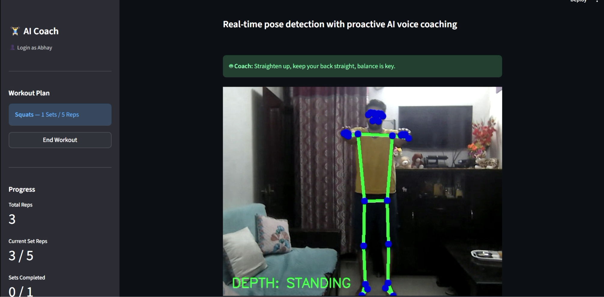
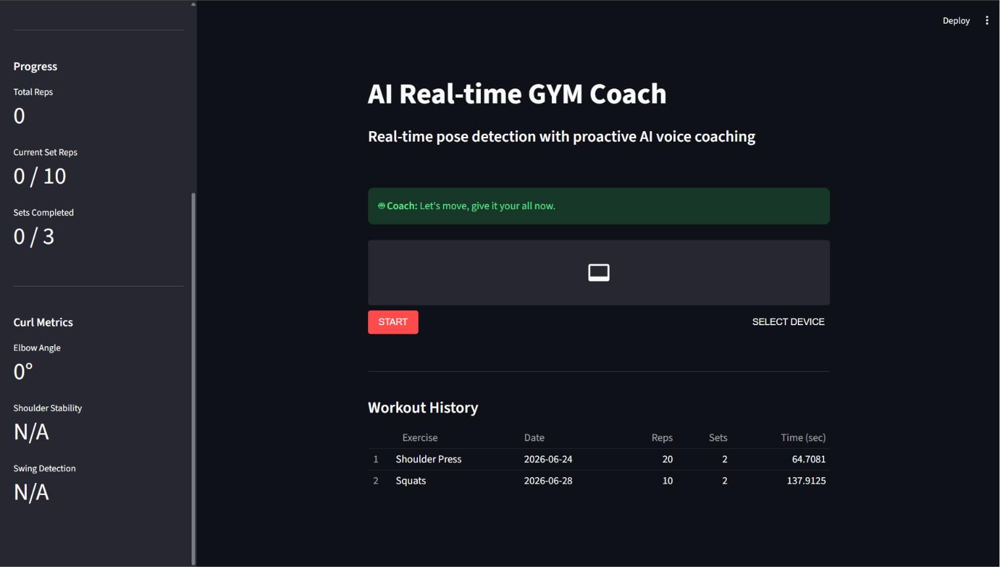
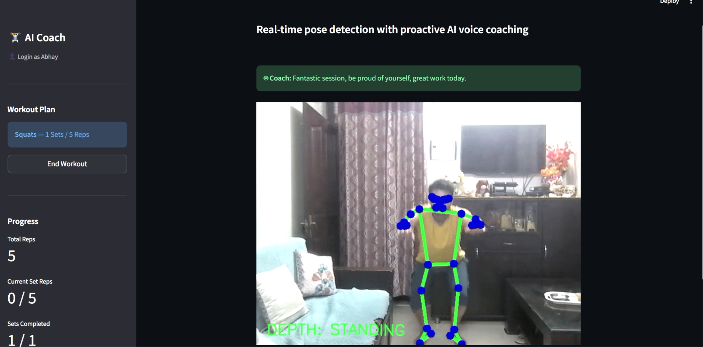
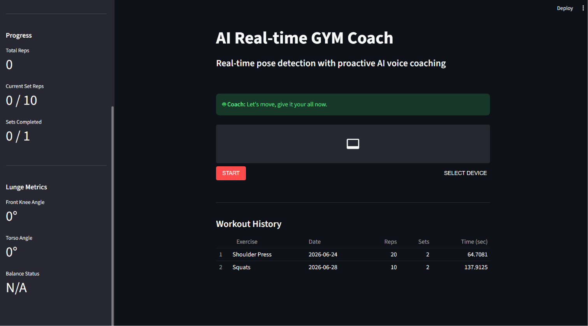

<div align="center">

<br/>

```
██████╗ ███████╗ █████╗ ██╗      ████████╗██╗███╗   ███╗███████╗
██╔══██╗██╔════╝██╔══██╗██║      ╚══██╔══╝██║████╗ ████║██╔════╝
██████╔╝█████╗  ███████║██║         ██║   ██║██╔████╔██║█████╗  
██╔══██╗██╔══╝  ██╔══██║██║         ██║   ██║██║╚██╔╝██║██╔══╝  
██║  ██║███████╗██║  ██║███████╗    ██║   ██║██║ ╚═╝ ██║███████╗
╚═╝  ╚═╝╚══════╝╚═╝  ╚═╝╚══════╝   ╚═╝   ╚═╝╚═╝     ╚═╝╚══════╝

 █████╗ ██╗     ██████╗ ██╗   ██╗███╗   ███╗     ██████╗ ██████╗  █████╗  ██████╗██╗  ██╗
██╔══██╗██║    ██╔════╝ ╚██╗ ██╔╝████╗ ████║    ██╔════╝██╔═══██╗██╔══██╗██╔════╝██║  ██║
███████║██║    ██║  ███╗ ╚████╔╝ ██╔████╔██║    ██║     ██║   ██║███████║██║     ███████║
██╔══██║██║    ██║   ██║  ╚██╔╝  ██║╚██╔╝██║    ██║     ██║   ██║██╔══██║██║     ██╔══██║
██║  ██║██║    ╚██████╔╝   ██║   ██║ ╚═╝ ██║    ╚██████╗╚██████╔╝██║  ██║╚██████╗██║  ██║
╚═╝  ╚═╝╚═╝     ╚═════╝    ╚═╝   ╚═╝     ╚═╝     ╚═════╝ ╚═════╝ ╚═╝  ╚═╝ ╚═════╝╚═╝  ╚═╝
```

<br/>

`● AI-POWERED` &nbsp;&nbsp;`·`&nbsp;&nbsp; `REAL-TIME` &nbsp;&nbsp;`·`&nbsp;&nbsp; `GYM COACH`

<br/>

*Your form. Analyzed. Corrected. In milliseconds.*<br/>
*Computer vision that watches every rep and tells you exactly what to fix.*

<br/>

[](https://python.org)
[](https://streamlit.io)
[](https://mediapipe.dev)
[](https://docker.com)
[](https://anthropic.com)
[](https://sqlite.org)
[](LICENSE)

<br/>

| ⚡ `100ms` | 🏋️ `5+` | 🎯 `95%` | 🎙️ `AI Voice` |
|:---:|:---:|:---:|:---:|
| Avg Latency | Exercises | Form Accuracy | Real-Time Coaching |

<br/>

**[📸 Screenshots](#-screenshots) &nbsp;·&nbsp; [🚀 Quick Start](#-quick-start) &nbsp;·&nbsp; [⚡ Architecture](#-architecture) &nbsp;·&nbsp; [🏋️ Exercises](#-exercises)**

</div>

---

## 📸 Screenshots

<div align="center">

<br/>

**// GALLERY — Built for real athletes**



<br/><br/>

**// APP — Set your plan · Coach watches live**

&nbsp;

<br/><br/>

**// EXERCISES — Curls · Push-ups · Lunges**

&nbsp;&nbsp;

<br/><br/>

**// SESSION COMPLETE — History logged automatically**



<br/>

</div>

---

## 🎯 Overview

**AI Gym Coach** is a browser-based personal trainer powered by computer vision and AI. Point your webcam at yourself, pick an exercise, and it maps your skeleton across 33 keypoints in real time, counts every rep automatically, and speaks personalized form corrections through your speakers — no app, no subscription, no trainer fee.

---

## ⚡ Architecture

```
  ┌─────────────────────────────────────────────────────────────┐
  │                       WEBCAM FEED                          │
  └──────────────────────────┬──────────────────────────────────┘
                             │
                             ▼
  ┌─────────────────────────────────────────────────────────────┐
  │                 MEDIAPIPE POSE ENGINE                      │
  │             33 body keypoints  ·  ~100ms latency           │
  └──────────────┬──────────────────────────┬───────────────────┘
                 │                          │
                 ▼                          ▼
  ┌──────────────────────┐    ┌─────────────────────────────────┐
  │   detectors/         │    │   core/                         │
  │   Joint angle calc   │    │   Rep counter · Set manager     │
  │   Per-exercise logic │    │   State machine · Form scorer   │
  └──────────┬───────────┘    └────────────────┬────────────────┘
             └─────────────────┬───────────────┘
                               │
                               ▼
  ┌─────────────────────────────────────────────────────────────┐
  │                       services/                            │
  │          Claude AI  →  Coaching Text  →  Voice Output      │
  └──────────────────────────┬──────────────────────────────────┘
                             │
                             ▼
  ┌─────────────────────────────────────────────────────────────┐
  │                    SQLite  (data.db)                       │
  │           Exercise · Date · Reps · Sets · Duration         │
  └─────────────────────────────────────────────────────────────┘
```

---

## 🗂️ Project Structure

```
GymVision/
├── 📁 LandingPage/
│   ├── 📁 IMGs/               ← App screenshots (i1–i6.png)
│   ├── 📁 videos/             ← Demo reel (video.mp4)
│   ├── index.html             ← Hero · Gallery · Demo
│   └── style.css
│
├── 📁 MainPage/
│   ├── 📁 .streamlit/         ← Theme & server config
│   ├── 📁 core/               ← Rep counter · State machine
│   ├── 📁 detectors/          ← Per-exercise pose analyzers
│   ├── 📁 ml_models/          ← MediaPipe weights
│   ├── 📁 services/           ← Claude AI · TTS · Camera
│   ├── 📁 static/             ← UI assets
│   ├── .env                   ← 🔑 API keys — never commit
│   ├── data.db                ← SQLite workout history
│   ├── Dockerfile
│   ├── main.py                ← 🚀 Entry point
│   └── requirements.txt
│
└── 📁 screenshots/
```

---

## 🏋️ Exercises

| Exercise | Key Joints | Metrics Tracked |
|---|---|---|
| 🦵 Squats | Hip · Knee · Ankle | Knee angle · Depth · Back alignment |
| 💪 Bicep Curls | Shoulder · Elbow · Wrist | Elbow angle · Shoulder stability · Swing |
| 🙌 Shoulder Press | Elbow · Shoulder · Hip | Range of motion · Wrist lock · Symmetry |
| ⬇️ Push-ups | Shoulder · Elbow · Wrist | Body alignment · Hip sag · Elbow angle |
| 🦶 Lunges | Hip · Knee · Ankle (front) | Knee angle · Torso angle · Balance |

---

## 🚀 Quick Start

### Python

```bash
git clone https://github.com/your-username/GymVision.git
cd GymVision/MainPage

python -m venv venv && source venv/bin/activate
pip install -r requirements.txt

echo "ANTHROPIC_API_KEY=sk-ant-..." > .env
streamlit run main.py
```

### Docker 🐳

```bash
cd GymVision/MainPage
docker build -t gymvision .
docker run -p 8501:8501 -e ANTHROPIC_API_KEY=your_key gymvision
# → http://localhost:8501
```

---

## 🔐 Environment

```env
ANTHROPIC_API_KEY=sk-ant-api03-...     # Required — Claude AI coaching
COACHING_INTERVAL_SECONDS=5            # How often the AI speaks
TTS_ENABLED=true                       # Toggle voice output
STREAMLIT_SERVER_PORT=8501
```

> ⚠️ `.env` is already in `.gitignore` — never push API keys.

---

## 📦 Stack

| Layer | Technology |
|---|---|
| App Framework | Streamlit |
| Pose Detection | MediaPipe Pose — 33 keypoints |
| AI Coaching | Claude `claude-sonnet-4-6` |
| Voice Output | Web Speech API |
| Storage | SQLite `data.db` |
| Deployment | Docker |
| Landing Page | HTML + CSS |

---

## 🤝 Contributing

```bash
git checkout -b feature/your-feature
git commit -m "feat: describe what you added"
git push origin feature/your-feature
# → Open a Pull Request
```

**Ideas:** deadlift detector · progress charts · CSV export · mobile camera · multi-language voice

---

<div align="center">
<br/>

*Built with Python · Streamlit · MediaPipe · Claude AI*

⭐ **Star this if it helped you train smarter**

</div>
